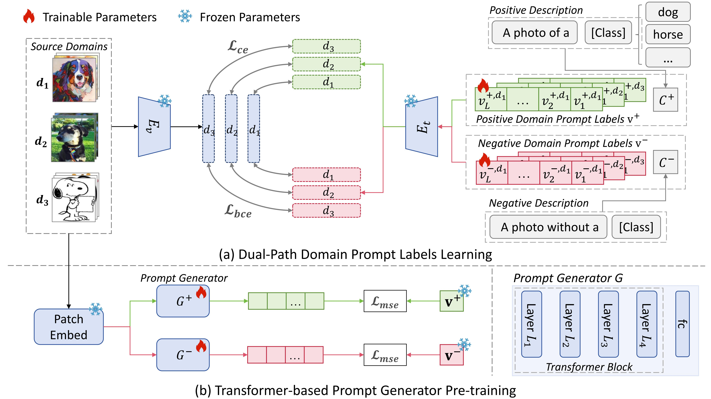

# Dual-Path Stable Soft Prompt Generation (DPSPG) ICME 2026[]

[](https://arxiv.org/abs/2505.18770)

Official implementation of the paper "[Dual-Path Stable Soft Prompt Generation for Domain Generalization](https://arxiv.org/abs/2505.18770)".

Authors: Yuedi Zhang, [Shuanghao Bai](https://baishuanghao.github.io/), [Wanqi Zhou](https://ellezwq.github.io/), [Zhirong Luan](https://scholar.google.com/citations?user=mJNCeucAAAAJ&hl=zh-CN), [Badong Chen](https://scholar.google.com/citations?user=mq6tPX4AAAAJ&hl=zh-CN&oi=ao).

<hr />

## 🎉 Highlights

<div align="center">
  
</div>

> **<p align="justify"> Abstract:** *Domain generalization (DG) aims to train models on related source domains that generalize to unseen out-of-distribution target domains. Prompt tuning of large pre-trained vision-language models (VLMs) improves DG but lacks domain-specific features due to fixed prompt inputs. Recent generation methods have addressed this limitation by dynamically gener ating instance-specific and domain-specific prompts, but suffer from Prompt Variability: the same input often yields different and suboptimal prompts across different random seeds. To address this, we introduce negative learning into prompt generation and propose Dual-Path Stable Soft Prompt Generation (DPSPG), a transformer-based framework via a complementary prompt generator producing negative prompts to reduce misleading information. Theoretical and empirical analyses confirm that negative learning increases the effective margin and lowers an upper bound on the gradient norm, yielding more robust prompts. Extensive experiments on five DG benchmark datasets show that DPSPG consistently outperforms state-of-the-art methods while maintaining prompt stability.* </p>

<details>
  
<summary>Main Contributions</summary>

1) We identify and formalize the Prompt Variability problem in dynamic prompt learning. To address this problem, we propose a novel framework, Dual-Path Stable Soft Prompt Generation (DPSPG), which introduces negative learning into prompt generation. This dual-path design leads to more stable and transferable prompts across domains.

2) We provide a theoretical analysis demonstrating that negative learning increases the effective decision margin, tightens the upper bound of the gradient norm, and reduces sensitivity to input perturbations, thereby offering a principled explanation for improved generalization.

3) Extensive experiments on five domain generalization benchmarks show that DPSPG consistently outperforms existing methods, achieving state-of the-art performance in both accuracy and prompt stability.
   
</details>

Please follow instrcutions below to reproduce the results. 

<hr />

## 🛠️ Installation 
For installation and other package requirements, please follow the instructions as follows. 
This codebase is tested on Ubuntu 20.04 LTS with python 3.8. Follow the below steps to create environment and install dependencies.

* Setup conda environment.
```bash
# Create a conda environment
conda create -y -n spg python=3.8

# Activate the environment
conda activate spg

# Install torch (requires version >= 1.8.1) and torchvision
# Please refer to https://pytorch.org/get-started/previous-versions/ if your cuda version is different
conda install pytorch==2.0.0 torchvision==0.15.0 torchaudio==2.0.0 pytorch-cuda=11.8 -c pytorch -c nvidia
```

* Install dassl library.
```bash
# Instructions borrowed from https://github.com/KaiyangZhou/Dassl.pytorch#installation
# Clone this repo
git clone https://github.com/KaiyangZhou/Dassl.pytorch.git
cd Dassl.pytorch

# Install dependencies
pip install -r requirements.txt

# Install this library (no need to re-build if the source code is modified)
python setup.py develop
cd ..
```

* Clone DPSPG code repository and install requirements.
```bash
# Clone DPSPG code base
git clone https://github.com/renytek13/Dual-Path-Stable-Soft-Prompt-Generation.git
cd Dual-Path-Stable-Soft-Prompt-Generation

# Install requirements
pip install -r requirements.txt
```


## 📁 Data Preparation
**Please download the datasets `PACS`, `VLCS`, `Office-Home`, `TerraIncognita` and `DomainNet`.**

You better place all datasets under the same folder `$DATA` for management. We describe how to install the PACS dataset as follows:
- Create a folder named `PACS/` under `$DATA`.
- Download `pacs.zip` from https://drive.google.com/uc?id=1m4X4fROCCXMO0lRLrr6Zz9Vb3974NWhE and extract the folder `pacs/images/`. Then put the folder `images/` under `PACS/`.
- Put the given folder `dpspg_coop_splits/` under `$DATA/PACS`.

The organized directory structure is as follows:
```
$DATA/PACS/
|–– images/
|   |–– art_painting/
|   |–– cartoon/
|   |–– photo/
|   |–– sketch/
|–– dpspg_coop_splits/
```


## 📈 Training and Evaluation

We provide the running scripts in `scripts`, which allow you to reproduce the results on the paper.

### Dual-Path Stable Domain Prompt Labels Learning

To obtain domain positive and negative prompt labels, please run the bash file in [scripts folder](scripts/dpspg_coop) as follows:
```bash
# Example: trains on PACS dataset with ResNet50 as the backbone. 
bash scripts/dpspg_coop/dpspg_coop.sh pacs RN50
```


### Transformer-based Prompt Generator Pre-training

Please run the bash file in [scripts folder](scripts/dpspg_transformer) as follows.
```bash
# Example: trains on PACS dataset with ResNet50 as the backbone. 
bash scripts/dpspg_transformer/dpspg_transformer.sh pacs RN50
```


### Evaluation
Please run the bash file in [scripts folder](scripts) as follows.
```bash
# Example: test PACS dataset with ResNet50 as the backbone. 
bash scripts/test.sh pacs dpspg_transformer RN50
```


## 📨 Contact

If you have any questions, please create an issue on this repository or contact us at zyd993@stu.xjtu.edu.cn.


## 🙏 Acknowledgements

Our code is based on [CoOp and CoCoOp](https://github.com/KaiyangZhou/CoOp), [MaPLe](https://github.com/muzairkhattak/multimodal-prompt-learning), and [SPG](https://github.com/renytek13/Soft-Prompt-Generation) repository. We thank the authors for releasing their codes. If you use their codes, please consider citing these works as well. 
